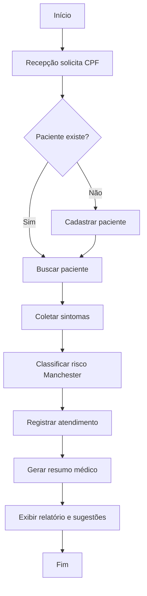

# Documentação Técnica

## 1. Objetivo

O sistema foi criado para agilizar a recepção e o atendimento de pacientes, além de apoiar o médico com histórico, resumo eletrônico e sugestões clínicas baseadas em regras condicionais.

## 2. Arquitetura

A solução foi organizada em camadas:

- Model: paciente e atendimento
- Repository: armazenamento em memória
- Service: regras de negócio e lógica clínica
- Controller: menu e fluxo do atendimento
- App: execução principal

## 3. Algoritmos

### Validação do CPF

- Remove caracteres não numéricos.
- Confere se há 11 dígitos.
- Verifica se todos os dígitos são iguais.
- Calcula os dígitos verificadores.
- Compara com os valores informados.

### Classificação de risco

O sistema usa `switch` e `if/else` para separar os atendimentos em:

- Emergência
- Muito Urgente
- Urgente
- Pouco Urgente
- Não Urgente

### Geração de resumo médico

O método percorre o histórico do paciente e consolida:

- nome
- CPF
- alergias
- sintomas recorrentes
- última urgência
- prescrição mais recente
- sugestão de conduta

## 4. Fluxograma

## 5. Testes

Os testes cobrem:

- validação correta de CPF
- rejeição de CPF inválido
- classificação de risco
- criação e busca de paciente
- geração de resumo com alergias

## 6. Observações de desenvolvimento

O sistema simula um backend Java funcional com estrutura organizada, permitindo extensão para banco relacional em etapas posteriores.
